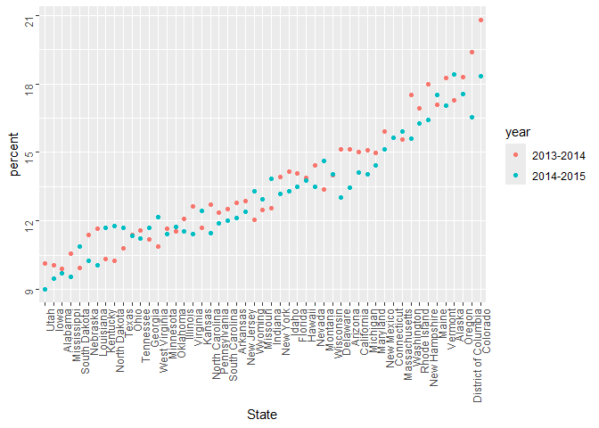

Strings and Factors
================
Mari Sanders

# Strings

``` r
string_vec <- c("my", "name", "is", "mari")

str_detect(string_vec, "mari")
```

    ## [1] FALSE FALSE FALSE  TRUE

``` r
str_replace(string_vec, "mari", "Mari")
```

    ## [1] "my"   "name" "is"   "Mari"

``` r
str_replace(string_vec, "e", "E")
```

    ## [1] "my"   "namE" "is"   "mari"

``` r
string_vec <- c(
  "i think we all rule for participating",
  "i think i have been caught",
  "i think this will be quite fun actually",
  "it will be fun, i think"
  )

str_detect(string_vec, "i think")
```

    ## [1] TRUE TRUE TRUE TRUE

``` r
str_detect(string_vec, "^i think")
```

    ## [1]  TRUE  TRUE  TRUE FALSE

``` r
str_detect(string_vec, "i think$")
```

    ## [1] FALSE FALSE FALSE  TRUE

^ indicates the beginning of the line \$ indicates the end of the line

``` r
string_vec <- c(
  "Time for a Pumpkin Spice Latte!",
  "went to the #pumpkinpatch last weekend",
  "Pumpkin Pie is obviously the best pie",
  "SMASHING PUMPKINS -- LIVE IN CONCERT!!"
  )

str_detect(string_vec,"pumpkin")
```

    ## [1] FALSE  TRUE FALSE FALSE

``` r
str_detect(string_vec, "Pumpkin")
```

    ## [1]  TRUE FALSE  TRUE FALSE

``` r
str_detect(string_vec, "PUMPKIN")
```

    ## [1] FALSE FALSE FALSE  TRUE

``` r
str_detect(string_vec, "[Pp]umpkin")
```

    ## [1]  TRUE  TRUE  TRUE FALSE

- \[Pp\] means either upper or lowercase P

``` r
string_vec <- c(
  '7th inning stretch',
  '1st half soon to begin. Texas won the toss.',
  'she is 5 feet 4 inches tall',
  '3AM - cant sleep :('
  )

str_detect(string_vec, "[0-9][a-zA-Z]")
```

    ## [1]  TRUE  TRUE FALSE  TRUE

- Detects a number and a letter

``` r
string_vec <- c(
  'Its 7:11 in the evening',
  'want to go to 7-11?',
  'my flight is AA711',
  'NetBios: scanning ip 203.167.114.66'
  )
str_detect(string_vec, "7.11")
```

    ## [1]  TRUE  TRUE FALSE  TRUE

- Detects number and a character then 2 numbers

``` r
string_vec = c(
  'The CI is [2, 5]',
  ':-]',
  ':-[',
  'I found the answer on pages [6-7]'
  )

str_detect(string_vec, "\\[")
```

    ## [1]  TRUE FALSE  TRUE  TRUE

- Put \\ in front of a character you want to find

# Factors

``` r
sex_vec <- factor(c("male", "male", "female", "female"))

as.numeric(sex_vec)
```

    ## [1] 2 2 1 1

**Releveling**

``` r
sex_vec <- fct_relevel(sex_vec, "male")

as.numeric(sex_vec)
```

    ## [1] 1 1 2 2

## Revisiting Examples

``` r
url = "https://samhda.s3-us-gov-west-1.amazonaws.com/s3fs-public/field-uploads/2k15StateFiles/NSDUHsaeShortTermCHG2015.htm"

drug_use_html <- read_html(url)
```

**Cleaning the data with `str`**

``` r
marj_use_df <- 
  drug_use_html %>% 
  html_table() %>%
  first() %>%  
  slice(-1) %>% 
  select(-contains("P Value")) %>% 
  pivot_longer(
    cols = -State, 
    names_to = "age_year",
    values_to = "percent"
  ) %>% 
  separate(age_year, into = c("age", "year"), sep = "\\(") %>% 
  mutate(
    year = str_replace(year, "\\)", ""), 
    percent = str_remove(percent, "[a-c]$"),
    percent = as.numeric(percent)
  ) 
```

``` r
marj_use_df %>%  
  filter(age == "12-17", !State %in% c("Total U.S.", "South", "Northeast", "Midwest", "West")) %>% 
  mutate(
    State = fct_reorder(State, percent)
  ) %>% 
  ggplot(aes(x = State, y = percent, color = year)) + 
  geom_point() + 
  theme(axis.text = element_text(angle = 90, vjust = 0.5, hjust = 1))
```

<!-- -->
